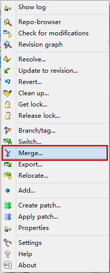
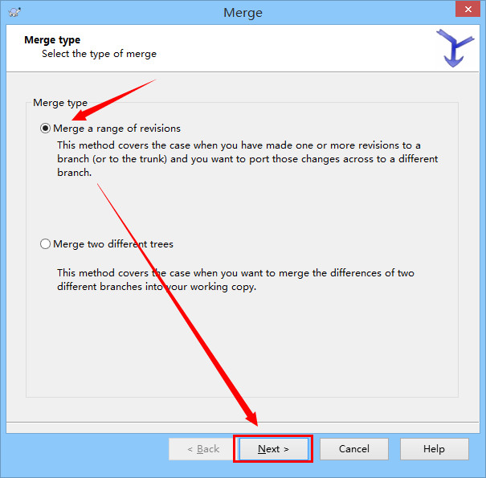
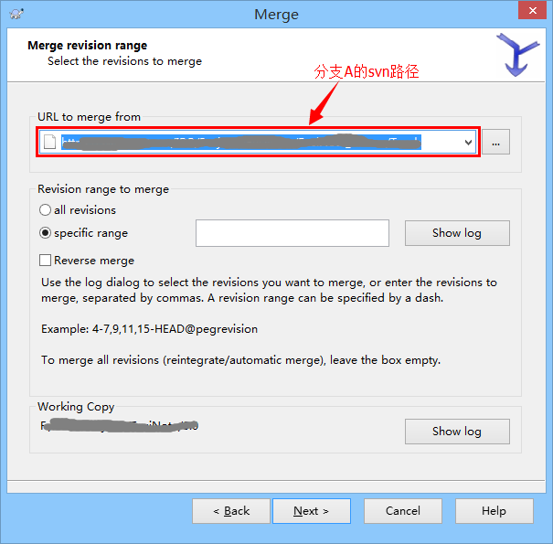
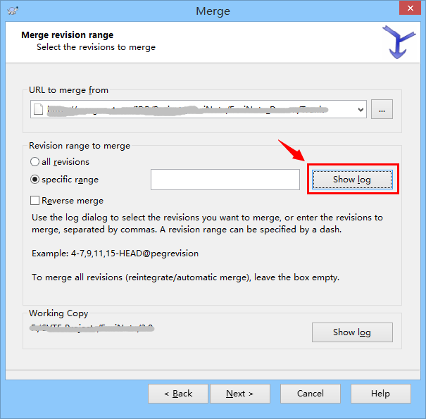
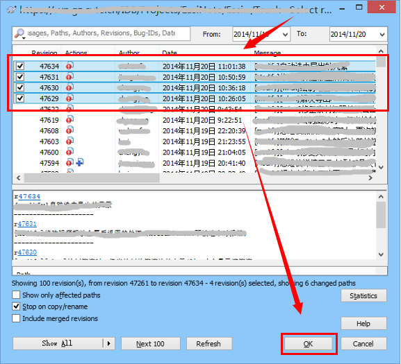
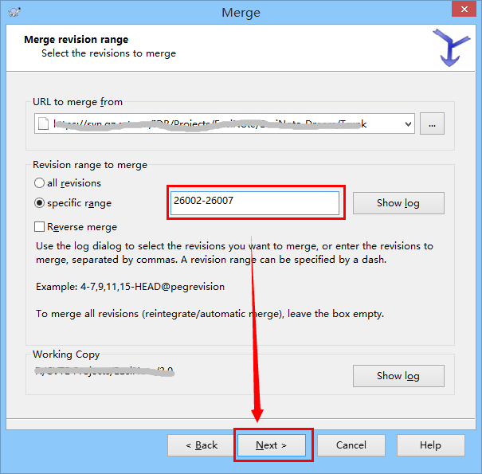
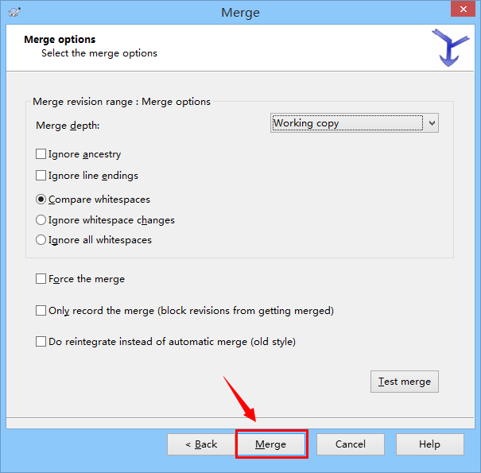

还不会合并SVN分支？看看这篇极简教程吧。

下列步骤展示了如何将分支A中的修改合并到分支B。

#### 1.在分支B的本地副本目录中选择"合并（Merge）"。

 

#### 2.选择“合并一个版本范围（Merge a range of revisions）”，点击下一步。

 

#### 3.输入分支A的svn服务器端路径（注意：此路径应与步骤1中的分支B本地路径相对应）。

 

#### 4.选择需要合并的修改内容，并点击下一步。

 

 

 

#### 5.合并（Merge）

#### 6.解决冲突（如果有的话），提交代码。完成！